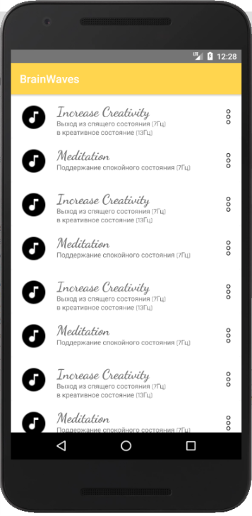
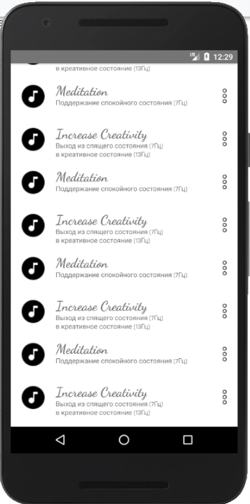
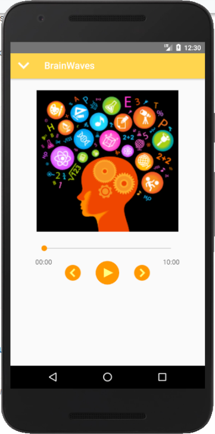

# Media Player written on Kotlin

### Bias

Media Player with animations between fragments written on Kotlin

### Preview

### TODO

- [ ] Циклическая прокуртка повторящихся треков с целью уменьшения размера файлов
- [x] Добавить callback на seekBar
- [ ] Переписать MediaPlayer на сервис
- [x] Автообновление положения seekBar через Handler
- [x] Заменить цвета согласно material design
- [x] Заменить иконки вперед, назад согласно концепту
- [ ] Добавить музыки
- [ ] Добавить обработчик кнопок назад вперед
- [x] Переделать концепт ListFragment
- [ ] К каждому треку подобрать картинку
- [x] К каждому треку подобрать название/описание
- [x] Добавить Toolbar для Activity
- [ ] Переопределить физическую кнопку назад для перехода между Fragments
- [x] Обновить иконку для приложения